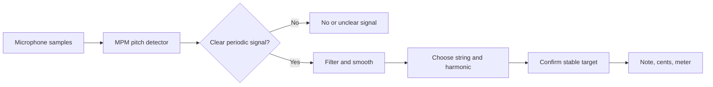
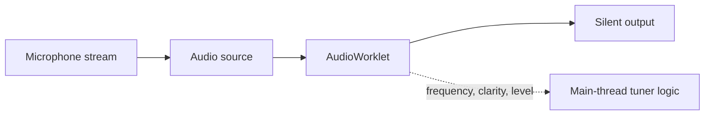
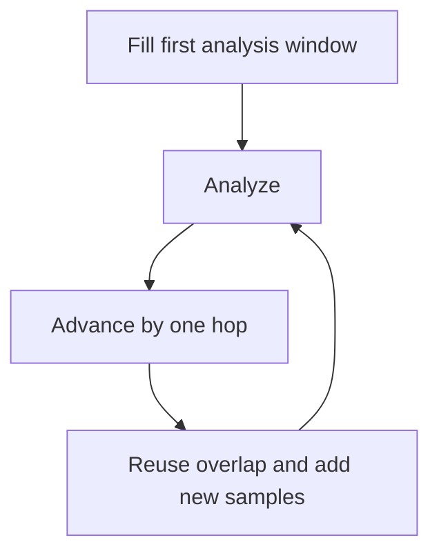
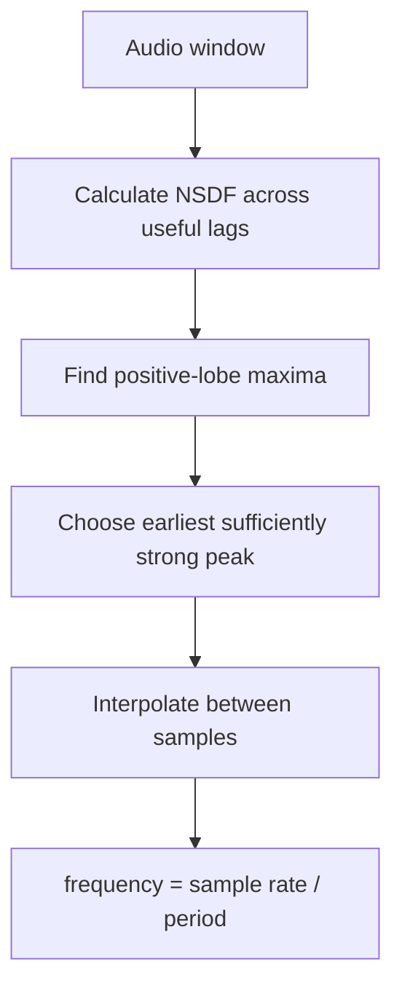
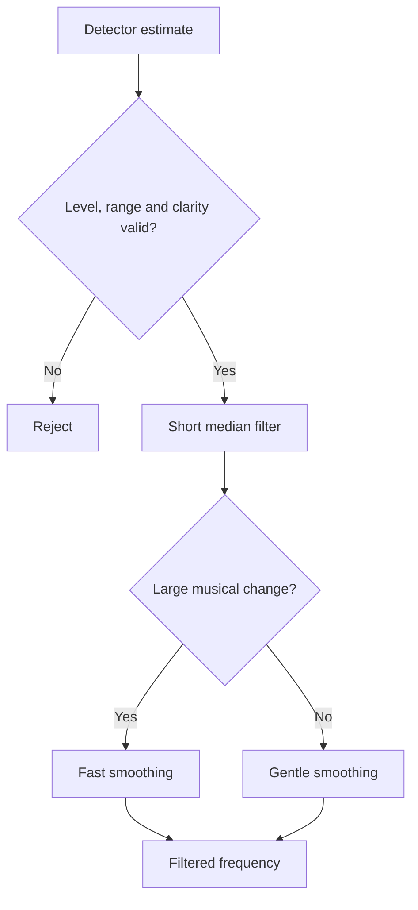
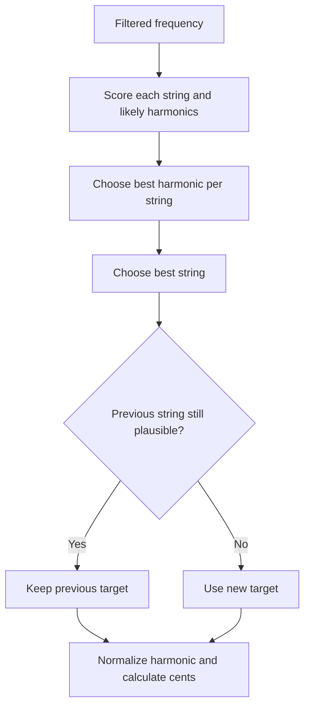
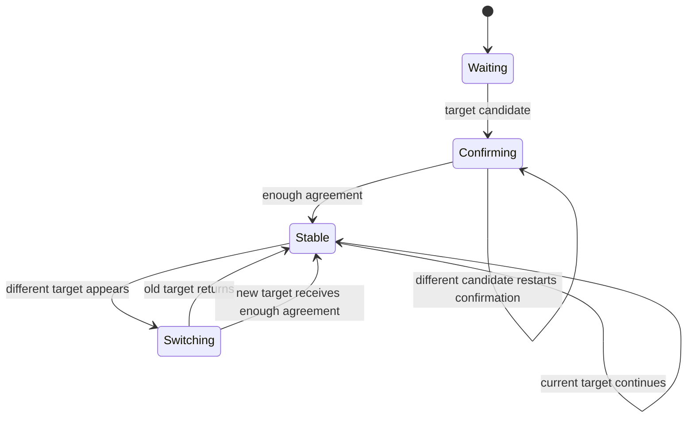

# Understanding Pitch Analysis

This guide explains how the tuner turns microphone sound into a stable guitar
string reading. It starts with basic audio concepts, then explains the purpose
of each processing stage. Exact thresholds remain in the source and tests.

## From Sound To A Reading

When a string is plucked, the app:

1. Receives microphone samples in an `AudioWorklet`.
2. Looks for repetition in a short section of the waveform.
3. Converts that repetition into a frequency.
4. Rejects unclear estimates and smooths small variations.
5. Compares the frequency with configured string targets and likely harmonics.
6. Confirms a target across several observations before changing the UI.
7. Reports the target and how many cents it is flat or sharp.



## Audio Basics

### Samples and sample rate

Sound is changing air pressure. A microphone converts it into numbers called
**samples**. The sample rate says how many samples make up one second. Browsers
commonly use 44.1 or 48 kHz, meaning 44,100 or 48,000 samples per second.

The app uses the browser's actual sample rate.

### Frequency and period

Frequency describes how often a wave repeats each second and is measured in
hertz. Standard guitar A2 is 110 Hz, so its waveform repeats about 110 times
per second.

The duration of one repetition is the **period**:

```text
frequency = sample rate / period in samples
```

At 48 kHz, a 110 Hz period is roughly 436 samples. Pitch detection is therefore
mainly a search for the waveform's repetition period.

### Notes, octaves, and cents

Doubling frequency raises a note by one octave: A2 is 110 Hz, A3 is 220 Hz,
and A4 is 440 Hz.

One octave contains 1,200 **cents**. Cents describe a ratio rather than a fixed
hertz difference:

```text
cents = 1200 × log2(measured frequency / target frequency)
```

- Negative cents: flat.
- Zero cents: exactly on target.
- Positive cents: sharp.

### Fundamentals and harmonics

A guitar note is not a clean sine wave. It contains a **fundamental** and
harmonics near two, three, four, and more times that frequency. Pick attack,
body resonance, fret noise, the room, and other strings add more complexity.

For low E near 82.4 Hz, a microphone may capture a strong component near
164.8 Hz. A tuner must avoid mistaking that second harmonic for the intended
note. This is why simply choosing the strongest FFT component is insufficient.

## Local Browser Audio

The browser requests instrument-friendly microphone processing, such as mono
input and disabled voice enhancement. Browsers and hardware may not honor every
preference.

Analysis happens in an `AudioWorklet`, away from page rendering. The graph ends
in a silent output so the browser keeps processing without playing microphone
sound through the speakers.



Only numeric analysis results cross to the main thread. Audio is not uploaded,
stored, or included in shareable settings.

## Overlapping Analysis Windows

One sample cannot reveal pitch. The detector needs a short **window** containing
several waveform repetitions. Each analysis reuses most of the previous window
and adds a smaller **hop** of new samples.



Larger windows help low notes but increase latency. Smaller hops update more
often but require more CPU. The current balance is tuned for guitar and tested
at common browser sample rates.

A light high-pass filter reduces DC offset and handling rumble below the useful
guitar range before pitch analysis.

## McLeod Pitch Method

The detector is an independent JavaScript implementation of the **McLeod Pitch
Method** (MPM), based on Philip McLeod and Geoff Wyvill's paper “A Smarter Way
to Find Pitch.”

### The intuition

Imagine making two copies of a waveform and sliding one copy to the right:

- At the wrong offset, peaks and valleys do not align.
- At one period, the copies align well.
- At two periods, they align again.

MPM measures this similarity at many offsets, called **lags**.

### NSDF

For each lag `τ`, the detector computes correlation:

```text
r(τ) = Σ x[j] × x[j + τ]
```

Raw correlation changes with volume and overlap length, so MPM normalizes it:

```text
m(τ) = Σ (x[j]² + x[j + τ]²)
NSDF(τ) = 2 × r(τ) / m(τ)
```

The Normalized Square Difference Function is approximately between -1 and 1.
A positive peak near 1 indicates clear repetition.



MPM chooses the earliest peak that is strong relative to the best peak. This
helps prefer the fundamental over a later period multiple. Interpolation with
neighboring values estimates a fractional-sample period and improves cent
accuracy.

The peak height is exposed as **confidence**, but it is better understood as
periodic clarity. It is not a probability, and a harmonic mistake can still
have high clarity.

## Rejecting Noise And Smoothing Pitch

The detector rejects very quiet or weakly periodic windows. A stricter
main-thread gate helps the UI distinguish silence from an audible but unclear
signal.

Accepted estimates pass through:

- a short median filter, which removes isolated outliers;
- adaptive smoothing in logarithmic frequency space.

Logarithmic smoothing matches musical perception: the same frequency ratio
represents the same interval anywhere on the instrument. Large changes follow
quickly, while small changes near a target move more calmly.



## Choosing The Intended String

Detecting a frequency and selecting a guitar target are separate problems.

Targets come from MIDI notes, A4 calibration, capo, and the selected tuning.
For every string, the tuner compares the measured pitch with the fundamental
and several integer harmonics.

A small penalty prefers fundamentals when candidates are otherwise similar.
Auto mode chooses the best-scoring string, while hysteresis keeps the previous
target when it remains nearly as plausible. Manual mode locks the string but
still recognizes its harmonics.



The final cents value is always calculated against the selected target. The UI
does not independently guess a note or string.

## Preventing Visible Flicker

Pick attacks and decays can briefly resemble another string or octave. A final
stabilizer requires repeated agreement before publishing the first target or
switching to another string. Once a string is stable, frequency and cents keep
updating immediately.



This behavior is validated with a real recording that plays every standard
string. The browser test records displayed note transitions and requires:

```text
E2 → A2 → D3 → G3 → B3 → E4
```

## Brief Gaps And Stale Readings

Short gaps are common during a pluck, so the previous reading remains visible
briefly. A sustained loss of accepted pitch clears the meter and tracking
state, preventing an old string from influencing the next pluck.

Microphone disconnection and worklet errors use separate lifecycle handling.
Moving the page to the background stops the microphone and requires an explicit
restart.

## Real-Time Performance

AudioWorklet code runs on a real-time audio thread. Unnecessary allocation can
cause garbage collection and glitches. The detector therefore reuses typed
buffers instead of copying each window or growing arrays.

The direct time-domain method costs more CPU than an FFT-based detector, but it
keeps the implementation compact and understandable while meeting the current
guitar fixtures.

## Validation

The analysis stack is tested at several levels:

- Pure detector tests cover common sample rates, detuning, harmonics, noise,
  and silence.
- Unit tests cover musical math, filtering, target selection, and stabilization.
- Six unchanged Voice Memos recordings cover individual open strings E2–E4.
- A full sequence recording checks visible target stability.
- Browser tests run recordings through the production worklet and UI pipeline.

See the [recording fixture guide](../tests/fixtures/guitar-recordings/README.md)
for naming and contribution rules.

## Limitations

- The detector is optimized for one clearly played guitar string.
- Its range covers standard open guitar, not every possible custom tuning and
  high-capo combination.
- The browser is asked for mono input, and the first input channel is analyzed.
- Confidence measures periodic clarity, not certainty about note identity.
- Harmonic handling uses frequency-ratio heuristics rather than spectral
  decomposition.
- Auto mode selects the best configured target for every accepted pitch; it
  does not reject pitches solely for being far from all targets.
- Automated audio integration runs in Chromium. Other browsers and real mobile
  devices still need manual validation.

## Further Reading

- Philip McLeod and Geoff Wyvill, “A Smarter Way to Find Pitch,” ICMC 2005:
  <https://www.cs.otago.ac.nz/graphics/Geoff/tartini/papers/A_Smarter_Way_to_Find_Pitch.pdf>
- MDN Web Audio API: <https://developer.mozilla.org/docs/Web/API/Web_Audio_API>
- MDN AudioWorklet: <https://developer.mozilla.org/docs/Web/API/AudioWorklet>
- MIDI tuning standard: <https://en.wikipedia.org/wiki/MIDI_tuning_standard>

The detector was implemented independently from the MPM paper and validated
against synthetic and original guitar recordings.
