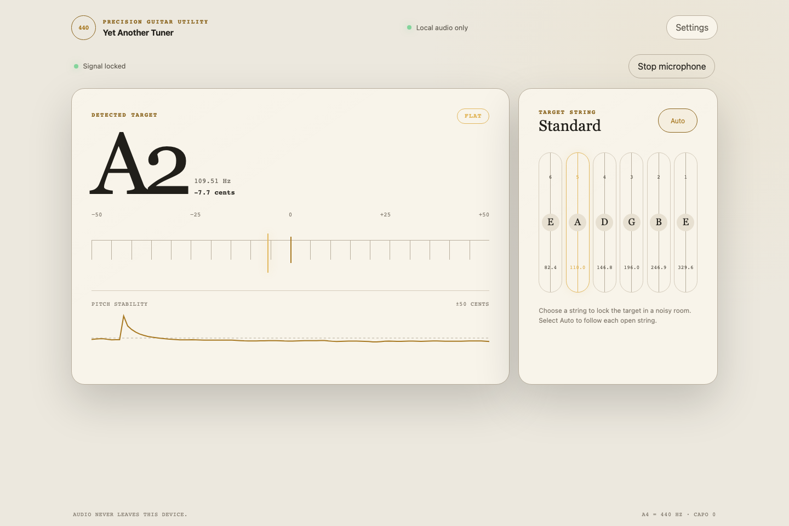
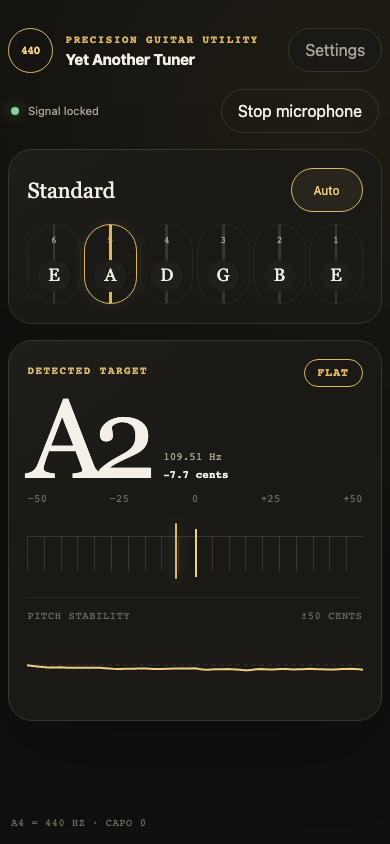

# Yet Another Guitar Tuner

A lightweight browser guitar tuner built with modern JavaScript and the Web
Audio API. Microphone audio is processed locally in an `AudioWorklet` using a
pure-JavaScript McLeod Pitch Method detector; it is not uploaded or stored.
The worklet keeps audio analysis off the page's UI thread, while only compact
numeric estimates return to drive the meter and graph.

The app provides automatic or manually locked six-string target detection,
target-relative pitch feedback, a tuning meter and history chart. See
[`docs/pitch-analysis.md`](./docs/pitch-analysis.md) for a beginner-friendly,
diagrammed explanation of the audio-analysis concepts.

Current controls include standard and alternate tuning presets, A4 calibration,
capo transposition, manual string locking, input-device selection, themes, and
left-handed orientation. A validated custom six-string tuning and explicit
reference-tone generator are also available in Settings. Preferences stay in
local browser storage; shareable musical settings use the URL hash and never
include microphone identifiers.

The interface supports system, light, and dark themes.
The responsive active tuner keeps its pitch meter and history graph visible on
mobile screens while preserving the full desktop view.

**Light theme, desktop**



**Dark theme, mobile**



## Live Demo

<https://olekboiko.com/yet-another-tuner/>

Microphone access requires HTTPS or local development on `localhost`.

## Requirements

- Node.js `^20.19.0`, `^22.13.0`, or `>=24`
- pnpm 9.15.0

## Development

```sh
pnpm install --frozen-lockfile
pnpm dev
```

## Checks

```sh
pnpm lint
pnpm test
pnpm check
pnpm build
pnpm exec playwright install chromium
pnpm test:browser
```

`pnpm lint` runs ESLint and strict TypeScript checking over JavaScript and
JSDoc without emitting or compiling application code. Shared contracts live
in module-scoped `.d.ts` files and are imported with JSDoc `@import`.

`pnpm check` runs lint/type-checking, unit tests, and a production build.
Browser integration tests run separately with `pnpm test:browser`.

## Technical Documentation

- [Pitch analysis, MPM/NSDF, smoothing, target selection, and flicker control](./docs/pitch-analysis.md)
- [Real guitar fixture conventions](./tests/fixtures/guitar-recordings/README.md)
- [Contributor and agent guidance](./AGENTS.md)

## Production

```sh
pnpm build
pnpm preview
```

The static `dist/` artifact has no backend dependency and is deployed to
GitHub Pages by `.github/workflows/deploy.yml`.

## License

MIT. See [`LICENSE`](./LICENSE).
